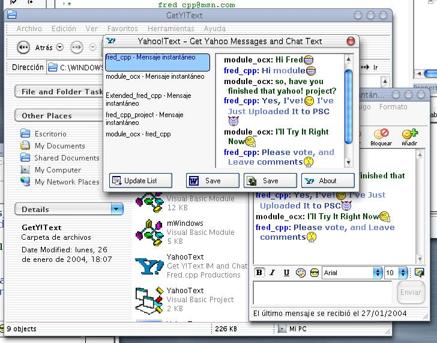



## \_\_\_ Get Yahoo\! PM and Chat Text \_\_\_

### Description

Have You Ever Wanted to Get The Yahoo! Messenger IM Windows Text get copied with colors and Smileys? this will do It and Will Do It With Style. It enumerates the Y!IMWindows and let you select and save each one. Supports the Word XP Formats and IE (html, mht, txt) formats.

Please, leave comments and If You Want (please!) votes.

If you want only the executable, you gan get it on my web page: http://mx.geocities.com/fred_cpp/
 
### More Info
 

             |
---                |---
**Submitted On**   |2004-01-27 02:44:02
**By**             |[Fred\.cpp](https://github.com/Planet-Source-Code/PSCIndex/blob/master/ByAuthor/fred-cpp.md)
**Level**          |Intermediate
**User Rating**    |4.8 (24 globes from 5 users)
**Compatibility**  |VB 5\.0, VB 6\.0
**Category**       |[Complete Applications](https://github.com/Planet-Source-Code/PSCIndex/blob/master/ByCategory/complete-applications__1-27.md)
**World**          |[Visual Basic](https://github.com/Planet-Source-Code/PSCIndex/blob/master/ByWorld/visual-basic.md)
**Archive File**   |[\_\_\_\_Get\_Ya1700181272004\.zip](https://github.com/Planet-Source-Code/fred-cpp-get-yahoo-pm-and-chat-text__1-51271/archive/master.zip)

### API Declarations

lots

